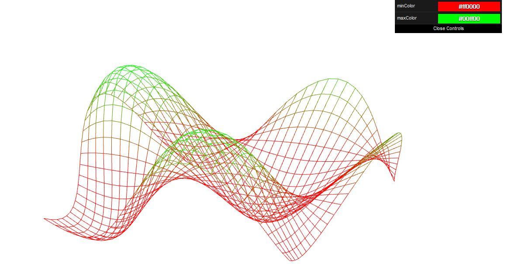
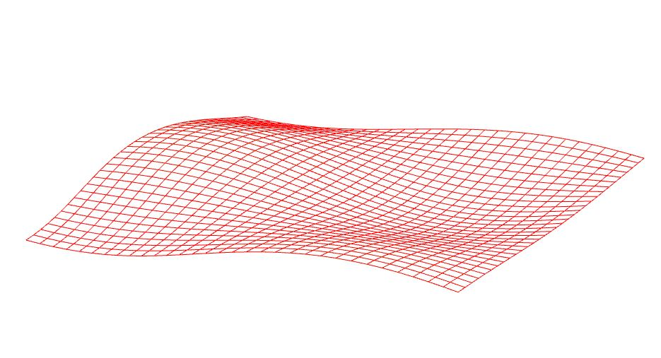
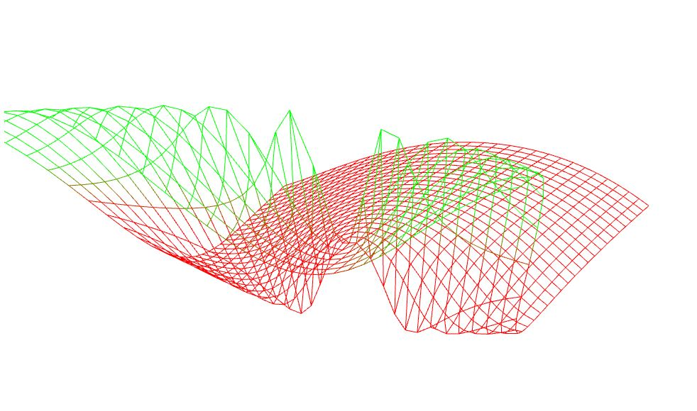
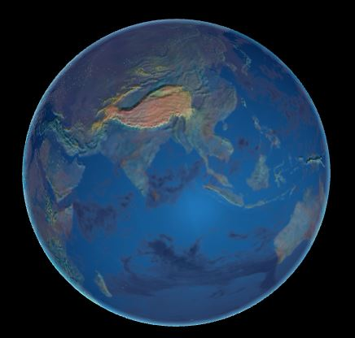
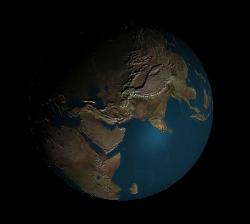

-------------------------------------------------------------------------------
CIS565: Project 5: WebGL
-------------------------------------------------------------------------------
Fall 2014
-------------------------------------------------------------------------------

-------------------------------------------------------------------------------
INTRODUCTION:
-------------------------------------------------------------------------------
In this project, you will get introduced to the world of GLSL in two parts: 
vertex shading and fragment shading. The first part of this project is the 
Image Processor, and the second part of this project is a Wave Vertex Shader.

In the first part of this project, you will implement a GLSL vertex shader as 
part of a WebGL demo. You will create a dynamic wave animation using code that 
runs entirely on the GPU.

In the second part of this project, you will implement a GLSL fragment shader
to render an interactive globe in WebGL. This will include texture blending,
bump mapping, specular masking, and adding a cloud layer to give your globe a 
uniquie feel.

-------------------------------------------------------------------------------
PART 1 IMPLEMENTATIONS: Vertex Shader
-------------------------------------------------------------------------------

* A sin-wave based vertex shader:


* Bump vertex shader:


* Beautiful wave:


-------------------------------------------------------------------------------
PART 2 IMPLEMENTATIONS: Fragment Globe 
-------------------------------------------------------------------------------

**Gh-pages**

http://radiumyang.github.io/Project5-WebGL/

**Feature List**

* Bump mapped terrain
* Rim lighting to simulate atmosphere
* Night-time lights on the dark side of the globe
* Specular mapping
* Moving clouds

Extra:
* Shade based on altitude using the height map

Final Result with all features merged:



### STEP 1: Bumping Map



### STEP 2: NightColor + Rim + Specular Color


Figure 2. Completed globe renderer, night side.


Figure 3. Initial globe with diffuse and specular lighting.

**Night Lights**

The backside of the globe not facing the sun is completely black in the 
initial globe. Use the `diffuse` lighting component to detect if a fragment 
is on this side of the globe, and, if so, shade it with the color from the 
night light texture, `u_Night`. Do not abruptly switch from day to night; 
instead use the `GLSL mix` function to smoothly transition from day to night 
over a reasonable period. The resulting globe will look like Figure 4. 
Consider brightening the night lights by multiplying the value by two. 

The base code shows an example of how to gamma correct the nighttime texture:

```glsl
float gammaCorrect = 1/1.2;
vec4 nightColor = pow(texture2D(u_Night, v_Texcoord), vec4(gammaCorrect));
```

Feel free to play with gamma correcting the night and day textures if you 
wish. Find values that you think look nice!


Figure 4. Globe with night lights and day/night blending at dusk/dawn.

**Specular Map** 

Our day/night color still shows specular highlights on landmasses, which 
should only be diffuse lit. Only the ocean should receive specular highlights. 
Use `u_EarthSpec` to determine if a fragment is on ocean or land, and only 
include the specular component if it is in ocean.


Figure 5. Globe with specular map. Compare to Figure 4. Here, the specular 
component is not used when shading the land.

**Clouds**

In day time, clouds should be diffuse lit. Use `u_Cloud` to determine the 
cloud color, and `u_CloudTrans` and `mix` to determine how much a daytime 
fragment is affected by the day diffuse map or cloud color. See Figure 6.

In night time, clouds should obscure city lights. Use `u_CloudTrans` and `mix` 
to blend between the city lights and solid black. See Figure 7.

Animate the clouds by offseting the `s` component of `v_Texcoord` by `u_time` 
when reading `u_Cloud` and `u_CloudTrans`.


Figure 6. Clouds with day time shading.


Figure 7. Clouds observing city nights on the dark side of the globe.

**Bump Mapping**

Add the appearance of mountains by perturbing the normal used for diffuse 
lighting the ground (not the clouds) by using the bump map texture, `u_Bump`. 
This texture is 1024x512, and is zero when the fragment is at sea-level, and 
one when the fragment is on the highest mountain. Read three texels from this 
texture: once using `v_Texcoord`; once one texel to the right; and once one 
texel above. Create a perturbed normal in tangent space:

`normalize(vec3(center - right, center - top, 0.2))`

Use `eastNorthUpToEyeCoordinates` to transform this normal to eye coordinates, 
normalize it, then use it for diffuse lighting the ground instead of the 
original normal.


Figure 8. Bump mapping brings attention to mountains.

**Rim Lighting**

Rim lighting is a simple post-processed lighting effect we can apply to make 
the globe look as if it has an atmospheric layer catching light from the sun. 
Implementing rim lighting is simple; we being by finding the dot product of 
`v_Normal` and `v_Position`, and add 1 to the dot product. We call this value 
our rim factor. If the rim factor is greater than 0, then we add a blue color 
based on the rim factor to the current fragment color. You might use a color 
something like `vec4(rim/4, rim/2, rim/2, 1)`. If our rim factor is not greater 
than 0, then we leave the fragment color as is. Figures 0,1 and 2 show our 
finished globe with rim lighting.

For more information on rim lighting, 
read http://www.fundza.com/rman_shaders/surface/rim_effects/index.html.


-------------------------------------------------------------------------------
PERFORMANCE EVALUATION
-------------------------------------------------------------------------------

In this homework, we do not expect crazy performance evaluation in terms of
optimizations.  However, it would be good to take performance benchmarks at
every step in this assignment to see how complicated fragment shaders affect the
overall speed.  You can do this by using stats.js.

