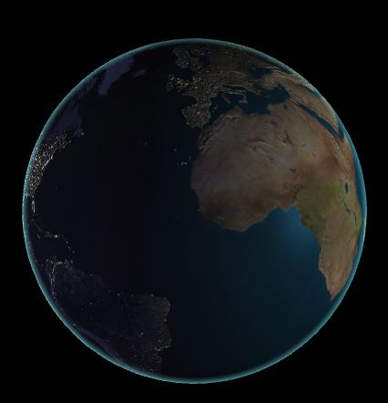

-------------------------------------------------------------------------------
CIS565: Project 5: WebGL
-------------------------------------------------------------------------------
Fall 2014
-------------------------------------------------------------------------------

-------------------------------------------------------------------------------
INTRODUCTION:
-------------------------------------------------------------------------------
In this project, you will get introduced to the world of GLSL in two parts: 
vertex shading and fragment shading. The first part of this project is the 
Image Processor, and the second part of this project is a Wave Vertex Shader.

In the first part of this project, you will implement a GLSL vertex shader as 
part of a WebGL demo. You will create a dynamic wave animation using code that 
runs entirely on the GPU.

In the second part of this project, you will implement a GLSL fragment shader
to render an interactive globe in WebGL. This will include texture blending,
bump mapping, specular masking, and adding a cloud layer to give your globe a 
uniquie feel.

-------------------------------------------------------------------------------
PART 1 IMPLEMENTATIONS: Vertex Shader
-------------------------------------------------------------------------------

* A sin-wave based vertex shader:

* Bump vertex shader:

Reference: http://www.benjoffe.com/code/tools/functions3d/examples

* Beautiful wave:

Reference: http://commons.wikimedia.org/wiki/File:3d-function-continuous.svg

-------------------------------------------------------------------------------
PART 2 IMPLEMENTATIONS: Fragment Globe 
-------------------------------------------------------------------------------

**Gh-pages**

http://radiumyang.github.io/Project5-WebGL/

**Feature List**

* Bump mapped terrain
* Rim lighting to simulate atmosphere
* Night-time lights on the dark side of the globe
* Specular mapping
* Moving clouds

Extra:
* Shade based on altitude using the height map

Final Result with all features merged:

### STEP 1: Bumping Map

### STEP 2: NightColor + Rim + Specular Color

### STEP 3: Add Animated Cloud

### STEP 4: Add Depth Mapping

Depth Mapping Only:

merged with other shading:

-------------------------------------------------------------------------------
PERFORMANCE EVALUATION
-------------------------------------------------------------------------------

In this homework, we do not expect crazy performance evaluation in terms of
optimizations.  However, it would be good to take performance benchmarks at
every step in this assignment to see how complicated fragment shaders affect the
overall speed.  You can do this by using stats.js.

